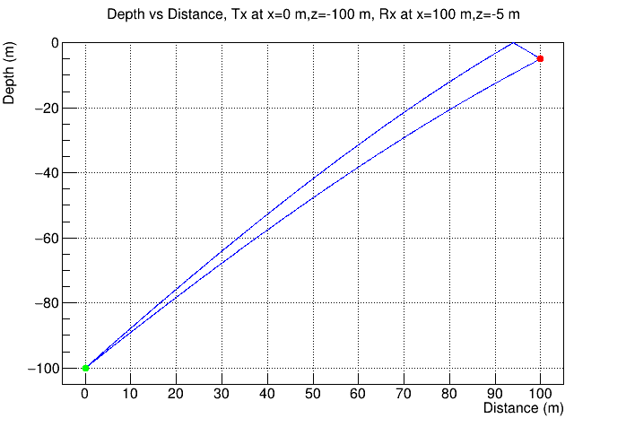
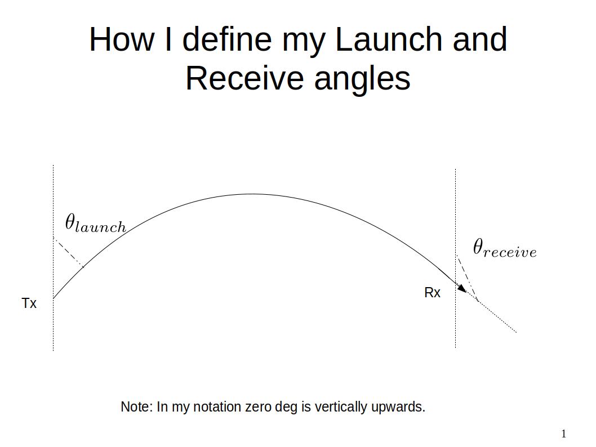

# AnalyticRayTracing in Ice
C++ code, which uses analytic ray tracing for tracing rays between any two points in ice. Currently I have set it to work with AraSim n(z)=1.78-0.43exp(0.0132z)

- IceRayTracing.C : This script takes in as arguments of the Tx and Rx coordinates. Then it calculates the two possible rays between them. It prints out the launch angle, receive angle and propagation time for both rays. 

It can also be made to print out the respective ray paths in text files called "DirectRay.txt","ReflectedRay.txt" and "RefractedRay.txt". For turning this feature ON you have to set the boolean "StoreRayPaths" in "IceRayTracing()" to be true. The files contain the following columns:

  - the entry number, Ray path x values, Ray path z values

- IceRayTracing_WROOTplot.C : This script ALSO takes in as arguments of the Tx and Rx coordinates. Then it calculates the two possible rays between them. It prints out the launch angle, receive angle and propagation time for both rays.

It can also be made to print out AND plot the respective ray paths in text files called "DirectRay.txt","ReflectedRay.txt" and "RefractedRay.txt". For turning this feature ON you have to set the boolean "Plot" in "IceRayTracing()" to be true. The files contain the following columns:

  - the entry number, Ray path x values, Ray path z values

An example of the output ray plots produced by IceRayTracing_WROOTplot.C.

- MultRay.C : This plots a Multi-Ray diagram of rays launching from a given transmitter (Tx) position. It takes in the given Tx depth and angle step size for launching rays and launches rays from 0 to 90 deg. Here the angle is measured w.r.t vertical where 0 deg is straight up. This macro depends on IceRayTracing_wROOTplot.C.

## namepsace "IceRayTracing"
The namespace folder contains two subfolders "wROOT" and "woROOT". I made a namespace for my raytracing functions, making it easier to include them as part of another code. The namespace is contained in "IceRayTracing.cc" and "IceRayTracing.hh".

  - The namespace in the folder "wROOT" has ROOT dependency and contains some ROOT functions which are used for plotting the rays.
  - The namespace in the folder "woROOT" does NOT have a ROOT dependency, and instead of using ROOT functions for plotting, it stores ray paths in c++ vectors.
  - The script "uzairRayTrace.cc" contains an example of how to call functions from within the namespace to do raytracing in ice.
  - To compile the code do `make uzairRayTrace`

## Prerequisites
You will need to have a functioning installation of [GSL](https://www.gnu.org/software/gsl/) ([2.4](https://ftp.gnu.org/gnu/gsl/gsl-2.4.tar.gz) is verified to work).
- You will need to set the environment variable `GSLDIR` to your local installation of GSL.
- You will also need to have `GSLDIR` in your `LD_LIBRARY_PATH`.
- For Mac users: you can locate your GSL installation via `gsl-config --prefix`, i.e. `export GSLDIR=$(gsl-config --prefix)`
- If you have Ubuntu or Linux you can skip all of the above and get it from the repository by doing: `sudo apt install libgsl-dev`

## How to install and run the scripts

### IceRayTracing.C as standalone package
To run, you have to do:
- Make it: `make IceRayTracing`
- Run it: `./IceRayTracing 0 0 -100 0 100 -5`
- Here the first three arguments are Tx coordinates (i.e., x_Tx=0 m, y_Tx=0 m, z_Tx=-100 m)  and the second three arguments are Rx coordinates (i.e., x_Rx=0 m, y_Rx=100 m, z_Rx=-5 m). 
- The main is at the bottom of the code, which you can modify to your liking.

### IceRayTracing_wROOTplot.C as standalone package
To run, you have to do:
- `root -l 'IceRayTracing_wROOTplot.C('0','0','-100','0','100','-5')'`
- Here the first three arguments are Tx coordinates (i.e., x_Tx=0 m, y_Tx=0 m, z_Tx=-100 m)  and the second three arguments are Rx coordinates (i.e., x_Rx=0 m, y_Rx=100 m, z_Rx=-5 m).

### MultRay.C as standalone package
To run, you have to do:
- `root -l 'MultRay.C('-180','0.25')'`
- Here the two arguments are the Tx depth (i.e., Tx_z=-180 m) and the launch angle step size (i.e., 0.25 deg)
- Please note that MultRay.C depends on IceRayTracing_wROOTplot.C, so you will have to include the two files in the same directory.